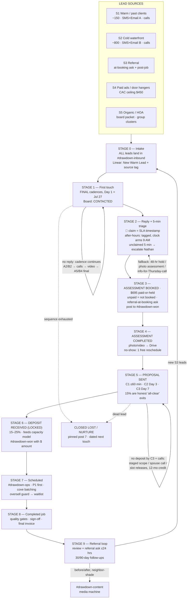

# DRAWDOWN 2026 — COMPLETE SALES FUNNEL MAP
## Deliverable 3.1 — Lead Source → Deposit → Completed Job → Referral Loop

Version: v1 FINAL (rev. 2026-07-27 — external red-team round applied; 10 fixes, see REVIEW_NOTES)
Date: 2026-07-27
Author: DRAWDOWN 2026 Swarm — Sales Engineering Writer Agent (6-layer pipeline complete: Draft, Skill Poll, Revision, Board Review, Devil's Advocate, Final; plus independent external red-team round)
Status: FINAL — Board verdict: APPROVED WITH NOTES; external red team REVISE (light) fully applied (see SALES_FunnelMap_Complete_v1_REVIEW_NOTES.md)
Sources: DRAWDOWN_2026_Master_Attack_Plan.md · DRAWDOWN_2026_Operations_Playbook.md · COPY_CallScript_Master_v1_FINAL.md · SLACK_SALES_BOARD_SETUP.md (Drive) · COPY_SMS/Email_SequenceSuite_v1_FINAL.md · **RECONCILIATION_Sheet_2026-07-27.md (supersedes any conflicting line herein)**

---

## 0. GROUND RULES (read before using this map)

1. **Hedged language only.** The drawdown is "projected," "being lined up," "pointing to October–November." We sell preparation, not prophecy. Every funnel stage inherits this rule — no stage, automation, or fallback may state the window as certain.
2. **Real scarcity only.** Approved structural numbers: **2 amphibious machines locked, ~25 working days in-window, "we committed in July."** Live counts (assessments booked, slots remaining, machine-days) come only from the `#drawdown-war-room` pinned counters, updated Mon + Thu, quoted only as "as of [Monday/Thursday]'s count."
3. **Slack is the floor, Linear is the ledger, Drive is the file cabinet.** Every stage below names its Slack surface and its same-day Linear logging action. No logging = it didn't happen.
4. **Cadences are FINAL and not re-opened here.** SMS (Sequences A/B/C), email (A/B/C), voicemail, and call cadences are anchored to Day 1 = Mon Jul 27, 2026. This map references them; it does not modify them.
5. **Unlabeled numbers are grounded in source docs; everything else is labeled** `working assumption, uncalibrated`. The weekly funnel review (Section 7) exists to replace assumptions with actuals.
6. **The Reconciliation Sheet wins.** Where this document and `RECONCILIATION_Sheet_2026-07-27.md` ever disagree, the sheet governs (booking = paid-or-held; after-hours silence; per-stage SLAs via Deliverable 3.3; OoO gate table; manual sends until automation L3).

---

## 1. FUNNEL OVERVIEW

**One sentence:** 1,000 outbound contacts plus inbound flows (referral, paid, organic/HOA) are worked through FINAL SMS/email/call cadences into ~80 booked Priority Assessments ($695, 100% credited, 12-month validity), of which ~60 produce proposals and ≥15 convert to deposits — funding the 3-crew / 25-day target case ($900K–1.1M) and feeding a referral loop that compounds into this window's back half and the next window's pipeline.

**Anchor numbers (from Master Plan + Order of Operations + reconciliation sheet):**

| Metric | Value | Source |
|---|---|---|
| Assessment price | $695, 100% credited, 12-month validity | Master Plan Part 1 |
| Typical package | $48K mid / $95K high-ticket | Master Plan Part 1 |
| Deposit | 15–25% of package ($7.5K mid / $15K high typical) | Master Plan Part 1–2 |
| Mix target | 15% assessment-only / 60% mid / 25% high | Master Plan Part 2 |
| Assessments needed | **80 booked by Sep 30** (Order of Operations); <60 by Sep 30 = DIAGNOSE floor; interim checkpoints 40 by Aug 31 / 60 by mid-Sep (exact mid-Sep date set at first Monday pipeline review) | Order of Operations, per reconciliation sheet (e) |
| Deposits needed | ≥15 (minimum); 25% proposal→deposit is a **conservative planning floor, not a target** | Reconciliation sheet (e) |
| Gross margin | 42% mid-size / 40% high-ticket | Master Plan Part 2 |
| Mid-size tier CAC target | $450 per mid-size customer (fully loaded); **no blended figure exists in source — blended CAC to be derived from actual mix** | Master Plan Part 2 |
| Speed-to-lead | 5-minute claim SLA in `#drawdown-inbound` (business hours 9:00 AM–6:00 PM Mon–Fri) | Slack Board spec + reconciliation sheet (b) |
| Follow-up floor | 3-touch minimum before nurture | Campaign decision |

**On conversion ambition:** the Master Plan's "50%+ conversion to deposits" was judged unachievable as a plan number; all planning in this document happens at the 25% proposal→deposit floor, reviewed weekly against actuals (reconciliation sheet (e)).

---

## 2. LEAD SOURCES (the top of the funnel)

List composition is a **working assumption, uncalibrated** — the actual warm/cold list counts must be dropped in from the CRM before Day 1 (placeholder P1). The model below is calibrated to hit the Order of Operations booking gates (40 by Aug 31 / 60 by mid-Sep / 80 by Sep 30).

| # | Source | Est. volume | Expected engagement | First-touch channel | Notes |
|---|--------|------------|---------------------|---------------------|-------|
| S1 | **Warm / past clients** | ~150 contacts *(assumption)* | ~55% engaged across full cadence | SMS A1 + personal email A1 (Mon Jul 27, 10:00 AM), call wave Day 2 | Highest-converting list. Relationship > sale — max one hold + one callback pressure (Call Script Hard Rule 5). |
| S2 | **Cold waterfront owners** | ~800 contacts *(assumption)* | ~9% engaged across full cadence | SMS B1 (Mon Jul 27) + email B1 (Tue Jul 28), call waves | Public-record sourced. Highest deliverability/compliance risk — Usage Block rules 1–3 of the SMS suite govern. |
| S3 | **Referral** | ~24 referral conversations in-window *(assumption)* | ~50% book | Personal call/text from rep (Scenario 3 script) | Two engines: (a) **referral-at-booking ask** (Call Script Branch 1E — every booked assessment is asked for neighbor names immediately); (b) post-job referral asks (Ops Playbook §11). Program activates October — log names now, tell referrers about credit when live. |
| S4 | **Paid (Meta/Google urgency ads + door hangers)** | ~$12K spend → ~60 leads *(assumption, uncalibrated — no budget line exists yet)* | ~12% of leads book | Inbound form/call → lands in `#drawdown-inbound` | Must live inside the $450 mid-size tier CAC target. First channel throttled if CAC breaks (Section 5c). Budget placeholder P3. |
| S5 | **Organic / HOA / multi-property** | ~50 HOA/multi-property contacts *(assumption)* | ~30% engaged | Scenario 4 call + board packet; door hangers in high-ticket coves | Group bookings arrive in clusters; group discount terms come from Nathan in writing only (Hard Rule 4). Grouped properties get scheduling priority — Ops Lead to confirm policy before reps say it (placeholder P5). |

**Intake rule:** every source, without exception, lands in `#drawdown-inbound` first (webhook for SMS/form replies; rep-posted for calls/walk-ins). No lead enters the pipeline by any other door.

---

## 3. STAGE-BY-STAGE FUNNEL SPEC

Ten stages. Each maps to one of the 7 pinned posts in `#drawdown-pipeline` (or to `#drawdown-ops` post-deposit), a Linear status, and the FINAL cadence assets. Card format everywhere: `Name — cove/street — source — last touch date — next action — rep initials`. Stage-stall limits, entry/exit criteria, and escalation paths are governed per Deliverable 3.3 (FINAL, 2026-07-27), which supersedes the interim 3-business-day rule everywhere in this map (reconciliation sheet (d)).

### STAGE 0 — Lead intake
- **Definition:** Contact exists in a source list or arrives inbound; not yet touched.
- **Conversion assumption:** 95% of outbound first touches deliver (SMS deliverability + email inboxing) — *working assumption, uncalibrated.*
- **Automation trigger:** SMS platform webhook → `#drawdown-inbound`; list imports create Linear issues in bulk with source tag (S1–S5).
- **Human touchpoint:** None yet. Harper/Lucas QA list hygiene (duplicates, non-waterfront, DNC scrub) before Day 1.
- **Slack → Linear:** `#drawdown-inbound` (inbound) / bulk import log → Linear issue created per lead, status `New Warm Lead`, source field required.

### STAGE 1 — First touch (SMS / email / call / social)
- **Definition:** Sequence A or B message 1 sent (or first cold call placed for call-first contacts).
- **Conversion assumption:** Delivered → engaged (cumulative across the full cadence, not first touch alone): warm 55%, cold 9%, HOA 30% — *working assumptions, uncalibrated; first-touch-only reply rates will be far lower and that is expected.*
- **Fallback if the step fails:** Cadence continues — A2/B2 non-responder touches, Day 2 call wave (40–50 dials/rep), Day 3 second SMS + LinkedIn/FB, Day 5 personal video/photo from the lake. After sequence exhaustion (A5/B4 final touch): silence, move to nurture; no sixth text ever. (All sends Jul 27–Aug 13 are manual from the platform by the assigned rep until automation L3 — reconciliation sheet, Day-1 manual operations.)
- **Automation trigger:** Cadence platform sends on the FINAL date-anchored calendar (Jul 27 anchor); sends logged. A human watches `#drawdown-inbound` for the first hour after every blast.
- **Human touchpoint:** Rep personal email paired with A1 (warm); rep places live calls Day 2 onward.
- **Slack → Linear:** Sends logged to Linear same-day (6:00 PM rule); card created/moved to pinned post **2. CONTACTED** once any touch lands.

### STAGE 2 — Reply + 5-minute triage
- **Definition:** Any inbound reply (SMS YES, email, callback, chat) lands in `#drawdown-inbound`. The 5-minute SLA clock starts here (business hours 9:00 AM–6:00 PM, Mon–Fri).
- **Conversion assumption:** Triage qualification is a real activity but is **not a separate modeled multiplier** — the §5a booking rates are engaged → booked with qualification folded in (see §5a note; external red-team fix F1).
- **Fallback if the step fails:** Unclaimed reply at 5 minutes → auto-escalation to Nathan (the SLA is the campaign's edge — Slack Board Hard Rule 2). Reply outside business hours → **captured immediately, tagged AFTER_HOURS, and the SLA clock arms at 9:00 AM the next business day** per reconciliation sheet (b). There is no auto-acknowledgment text — no automated outbound of any kind between 6:00 PM and 9:00 AM CT (the compliance-required opt-out confirmation is the sole exception).
- **Automation trigger:** Webhook posts reply to `#drawdown-inbound`; rep claims with a 👀 reaction (the claim is the timestamp of record).
- **Human touchpoint:** The claiming rep responds 1:1 within the SLA — links and booking options go out only in this 1:1 thread (SMS Global Rule 1).
- **Slack → Linear:** Claim logged in `#drawdown-inbound` thread; Linear status updated same-day with reply content, objection tags, and outcome.

### STAGE 3 — Assessment booked ($695 collected or 48-hr hold)
- **Definition:** Calendar slot committed + $695 paid via payment link (or explicit 48-hour hold with scheduled callback, logged — a booked next touch, per Call Script rules). **Per reconciliation sheet (a): unpaid = not booked; "pay on site" does not exist.** The 40/60/80 gate counts include only paid-or-held bookings.
- **Conversion assumption:** Engaged → booked (qualification folded in): warm 45%, cold 28%, HOA 40%, referral 50%, paid 12% of leads — *working assumptions, uncalibrated.*
- **Fallback if the step fails:** Three downsell paths, in order: (1) 48-hour hold + one-pager + scheduled callback; (2) photo assessment (homeowner texts shoreline photos, rep gives honest read on whether $695 is worth it); (3) "just send information" → trade information for a scheduled Thursday call (Call Script Branch 2E). 3-touch minimum before any lead goes to nurture.
- **Automation trigger:** Booking confirmation text sent within minutes (rep direct number included); calendar event created; **assessment-payment record** opened in Linear — this is the $695 fee, distinct from the Stage 6 package deposit.
- **Human touchpoint:** Rep closes with the two-option close (on-site day/time vs. photo assessment). **Every booking triggers the referral-at-booking ask** (Branch 1E): "any neighbors on your side of the cove been talking about their bulkhead?" Names logged immediately.
- **Slack → Linear:** Win posted to `#drawdown-won` ("Assessment booked — [Name] — [cove] — $695"); card moves to pinned post **3. ASSESSMENT BOOKED**; Linear status `Assessment Booked` same-day.

### STAGE 4 — Assessment completed
- **Definition:** On-site evaluation done: bulkhead, sediment depth, dock structure, drainage documented with photo/video; written prioritized scope in production.
- **Conversion assumption:** 93% of bookings complete (show/completion rate) — *working assumption, uncalibrated.*
- **Fallback if the step fails:** No-show → same-day reschedule call + text; one free reschedule, then the slot releases to the waitlist and the $695 credit stays valid 12 months. Weather/ops slip → rebook inside the same week; assessment slots are not the scarce resource — machine-days are.
- **Automation trigger:** Calendar completion → assessor uploads photo/video set to the Drive job folder; Sequence C armed (C1 within 60 minutes of report delivery — sent manually by the assigned rep until automation L3, per reconciliation sheet (c)).
- **Human touchpoint:** Assessor walk-through with the homeowner on-site where possible — this is the highest-trust moment in the funnel and sets up the proposal conversation.
- **Slack → Linear:** Card moves to pinned post **4. ASSESSMENT COMPLETED**; Linear status updated + Drive folder link attached same-day.

### STAGE 5 — Proposal delivered
- **Definition:** Written prioritized scope + rough order-of-magnitude pricing delivered (C1 within 60 minutes of report), followed by C2 (Day 3) and C3 (Day 7) if no response/deposit. (Sequence C is FINAL and fires manually until the scheduler is live; the Rulebook's Day 2/4/7 phone calls complement the C texts — both tracks run, neither duplicates a channel — reconciliation sheet (c).)
- **Conversion assumption:** 80% of completed assessments receive proposals (the remainder are genuine "all clear" outcomes — the 15% assessment-only segment; that is a product success, not a funnel failure) — *grounded in the Master Plan 15% assessment-only mix.*
- **Fallback if the step fails:** If scope finds nothing worth doing → deliver the documentation value explicitly (insurance/resale asset), keep the 12-month credit live, make the referral ask, move to nurture with a post-window follow-up date.
- **Automation trigger:** Report delivery timestamp fires Sequence C1 (manual send until L3); C2/C3 on Day 3/Day 7 non-response.
- **Human touchpoint:** Rep calls within 24 hours of C1 to walk the scope — proposals are not sent into a void. Nathan is looped on any full-cove ($95K-class) scope (escalation rule 7).
- **Slack → Linear:** Card moves to pinned post **5. PROPOSAL SENT**; Linear status `Proposal / Scope Sent` + proposal $ value logged same-day.

### STAGE 6 — Deposit received (LOCKED)
- **Definition:** 15–25% package deposit collected and confirmed; slot locked against the capacity model. **This is the campaign's point of no return.** (Distinct from the Stage 3 $695 assessment fee, which is credited toward the package.)
- **Conversion assumption:** ≥25% proposal → deposit — **conservative planning floor per reconciliation sheet (e), not a target.** The Master Plan's "50%+" ambition was judged unachievable as a plan number; planning happens at 25%, reviewed weekly against actuals.
- **Fallback if the step fails:** C2/C3 cadence continues; spouse joint-call offer (Rebuttal 10); staged-scope option (critical piece this window, stage the rest); insurance-pending structure (work scheduled contingent on claim — Rebuttal 3). If the deposit deadline passes: slot releases to waitlist, credit stays valid 12 months, card to nurture with a dated next touch.
- **Automation trigger:** Payment confirmation → `#drawdown-won` post **with $ amount** → feeds the capacity model (Ops Lead owns the math, never the reps); Mon/Thu pinned counters decrement slots/machine-days.
- **Human touchpoint:** Rep confirms by phone the day the deposit lands; Nathan personally thanks every high-ticket deposit.
- **Slack → Linear:** Card moves to pinned post **6. DEPOSIT RECEIVED (LOCKED)**; Linear status `Deposit Received (Locked)` + deposit $ + package tier logged same-day.

### STAGE 7 — Scheduled for drawdown
- **Definition:** Job slotted against crew-days, machine-days, permit timeline, and geographic clustering (Ops Playbook §4). P1 failing bulkheads first, grouped coves batched.
- **Conversion assumption:** 100% of deposits get scheduled — capacity is managed upstream at Stage 6, so Stage 7 never says no. **Oversell guard:** when committed deposit $ ÷ avg package $ approaches remaining crew-day capacity, new deposits shift to waitlist sequencing before any oversell occurs (real-time capacity dashboard, Ops Playbook §6).
- **Fallback if the step fails:** Permit delay → shift crew to next permitted job, notify client with new timeline (7-day permit-in-hand buffer). Capacity ceiling reached → honest waitlist with priority sequencing language; never promise a slot that doesn't exist.
- **Automation trigger:** Deposit-locked status → job packet creation in Linear; permit pre-filing checklist auto-generated (pre-file everything by Sept 1).
- **Human touchpoint:** Ops Lead confirms schedule window to the client; daily update cadence set for multi-day jobs.
- **Slack → Linear:** `#drawdown-ops` scheduling thread (the 7-post sales board ends at LOCKED; scheduling lives in ops); Linear status `Scheduled for Drawdown` + crew/machine-day allocation.

### STAGE 8 — Completed job
- **Definition:** Work executed in-window per scope; quality gates 1–3 passed; client sign-off obtained.
- **Conversion assumption:** ~90% of scheduled jobs complete inside the window; the rest slip on weather/permit buffers and carry into the credit-extended tail — *working assumption, uncalibrated (utilization 72–75% target case is the binding constraint).*
- **Fallback if the step fails:** Weather buffer days (2–3/week built in); equipment breakdown → pre-negotiated backup source; unrecoverable slip → client communication protocol + priority slot in the post-window tail.
- **Automation trigger:** Daily field logs (photos + progress notes) auto-feed the media machine; Gate 3 checklist completion triggers final invoice.
- **Human touchpoint:** Client walk-through and sign-off with crew lead; daily 8 AM / 4 PM / 6 PM client updates on multi-day jobs.
- **Slack → Linear:** `#drawdown-ops` completion post + before/after photo link; Linear status `Completed` + final invoice $ + review/referral checklist opened same-day.

### STAGE 9 — Referral loop
- **Definition:** Post-job protocol within 24 hours: review request (Google/Yelp/Nextdoor), referral ask, as-builts + warranty delivered, case study captured. 30-day and 90-day follow-ups per Ops Playbook §11.
- **Conversion assumption:** 1 in 3 completed jobs yields a named referral; 50% of referral conversations book — *working assumption, uncalibrated.* Note: post-job referrals land mostly **after** the window — they feed the 12-month-credit tail and the next window, not this one's October calendar. The in-window referral engine is Stage 3's referral-at-booking ask.
- **Fallback if the step fails:** No referral at completion → 30-day satisfaction call makes the second ask; testimonial request at 90 days.
- **Automation trigger:** Gate 3 completion → review-request send + 30/90-day follow-up tasks in Linear; referral names create new Stage 0 leads tagged S3.
- **Human touchpoint:** Crew lead / Ops Lead makes the ask at sign-off (highest-satisfaction moment); same-day thank-you text to every referrer (Call Script post-call rule).
- **Slack → Linear:** Review/referral outcomes logged to Linear same-day; referral wins post to `#drawdown-won`; neighbor-shade content flagged to `#drawdown-content` for QA.

---

## 4. VISUAL FLOWCHART

### 4a. Mermaid (render where supported)



### 4b. ASCII (for Slack / plain-text posting)

```
SOURCES                          BOARD STAGE              SCARCITY / LOGGING
─────────                        ──────────               ──────────────────
S1 warm ~150 ──┐
S2 cold ~800 ──┤
S3 referral ───┼──► [0 INTAKE] #drawdown-inbound ──► Linear: New + source tag
S4 paid ───────┤        │
S5 HOA ~50 ────┘        ▼
                 [1 FIRST TOUCH] SMS/email A+B, Day 1 = Jul 27 ──► CONTACTED
                        │  no reply → cadence continues (A2/B2, calls, video, final)
                        ▼
                 [2 REPLY + 5-MIN TRIAGE] 👀 claim │ unclaimed 5 min → Nathan
                        │  after-hours: tagged AFTER_HOURS, clock arms 9:00 AM
                        ▼
                 [3 ASSESSMENT BOOKED $695 paid-or-held] ──► #drawdown-won ──┐
                        │  unpaid = not booked                              │
                        │  fallback: 48-hr hold / photo assessment          │
                        ▼                                                   │
                 [4 ASSESSMENT COMPLETED] photos→Drive                      │
                        ▼                                                   │
                 [5 PROPOSAL SENT] C1 ≤60m · C2 d3 · C3 d7                  │
                        │  no deposit → staged scope / spouse call / nurture│
                        ▼                                                   │
                 [6 DEPOSIT LOCKED 15–25%] ──► #drawdown-won $ ──► capacity model
                        ▼                                              ▲ decrements
                 [7 SCHEDULED] #drawdown-ops · P1 first · cove batching──┘
                        ▼
                 [8 COMPLETED] gates 1–3 · sign-off · invoice
                        ▼
                 [9 REFERRAL LOOP] review + ask ≤24h ──► new S3 leads → back to [0]
```

---

## 5. FUNNEL MATH — 1,000 contacts → 15 deposits

### 5a. Stage-by-stage model

All per-channel rates are **working assumptions, uncalibrated**, calibrated so the model lands on the Order of Operations booking gates (40 by Aug 31 / 60 by mid-Sep / 80 by Sep 30) and the 15-deposit floor. The 25% proposal→deposit rate is a conservative planning floor (reconciliation sheet (e)); the 15/60/25 mix is the Master Plan target.

**Booking-rate basis (external red-team fix F1):** the booking rates below are **engaged → booked**. Triage qualification (Stage 2) is folded into these rates — there is no separate "qualified conversation" multiplier row. An earlier draft carried an 85% qualification row while applying booking rates to engaged counts, which double-counted; that row was removed, and the rates below were always computed on the engaged basis, so no booking numbers change.

| Stage | Warm (S1) | Cold (S2) | HOA (S5) | Referral (S3) | Paid (S4) | **Total** | Cumulative conv. |
|---|---|---|---|---|---|---|---|
| Contacts / inbound flows | 150 | 800 | 50 | 24 conv. | 60 leads | **1,000 + 84 inflow** | — |
| First touch delivered (95%) | 143 | 760 | 48 | 24 | 60 | **1,035** | — |
| Engaged across full cadence | 82 (55%) | 72 (9%) | 15 (30%) | 24 (100%) | 60 | **253** | — |
| **Assessment booked (% of engaged)** | 37 (45%) | 20 (28%) | 6 (40%) | 12 (50%) | 7 (12%) | **82** | ~8% of outbound list |
| **Assessment completed (93%)** | 34 | 19 | 6 | 11 | 6 | **76** | 93% of booked |
| **Proposal delivered (80%)** | 27 | 15 | 5 | 9 | 4 | **60** | 79% of completed |
| **Deposit locked (≥25%)** | 7 | 4 | 1 | 2 | 1 | **15** | 25% of proposals |
| Scheduled | 7 | 4 | 1 | 2 | 1 | **15** | 100% (capacity managed upstream) |
| Completed in-window (~90%) | 6 | 4 | 1 | 2 | 1 | **14** | utilization-constrained |
| Referral loop out | 2 | 1 | 1 | 1 | 0 | **~5 new S3 leads** | 1-in-3 jobs |

### 5b. Revenue check on 15 deposits (mix 15/60/25)

| Segment | Count | Price | Contract value |
|---|---|---|---|
| Assessment-only | 2 | $695 (fee kept) | $1,390 |
| Mid-size | 9 | $48,000 | $432,000 |
| High-ticket | 4 | $95,000 | $380,000 |
| **Total contract value** | **15** | | **~$812K** |
| + Assessment fees, **non-converters only** ((82 booked − 13 package buyers) × $695) | | | ~$48K |
| **Funnel gross** | | | **~$860K** |

(Fee math per external red-team fix F2: the 13 package buyers — 9 mid + 4 high-ticket — have their $695 fully credited, so their fees are not kept revenue. Kept fees = 82 booked − 13 package buyers = 69 × $695 ≈ $48K.)

**Honest read:** 15 deposits at the standard mix lands between the Floor case ($520K) and the Target case ($900K–1.1M) — ~$812K contract value, ~$860K gross with kept fees. **The $1M headline requires ~18–20 deposits, a mix shifted toward high-ticket/HOA group work, or both.** The funnel as modeled is the floor path, not the $1M path. This is the single most important number in this document — flagged for Nathan's weekly review.

### 5c. Where the math breaks (sensitivity table)

| Stage underperforms | Break scenario | Downstream effect | Revenue effect | Tripwire response |
|---|---|---|---|---|
| Warm engagement | 55% → 40% | Bookings 37 → 27; total ~72 | deposits ~13; ~$750K | Pull cold call wave forward; add paid spend inside CAC ceiling |
| Cold engagement | 9% → 6% | Bookings 20 → 13; total ~75 | deposits ~14 | Creative refresh; door hangers in highest-ticket coves |
| Cold list quality | 9% → 4% | Bookings → 9; total ~71 → **Aug 31 checkpoint (40) at risk** | deposits ~13 | Expand list (adjacent parcels); shift budget to HOA clusters |
| Show rate | 93% → 80% | Completed 76 → 66; proposals ~53 | deposits ~13 | Same-day confirmation calls; tighten reschedule policy |
| Proposal→deposit | 25% → 18% | Deposits 15 → **11** | **~$600K — Floor case** | Nathan joins high-ticket closes; staged-scope offers; deadline discipline on holds |
| Mix shift down | high-ticket 25% → 10% | Same 15 deposits | ~$700K | Route full-cove scopes to Nathan; HOA group packaging |
| Paid CAC | $450 → $700+ | Mid-size CAC target broken | margin erosion at 42% | **Throttle paid first** — warm/referral channels carry the funnel |
| Capacity oversell | deposits > ~20 | crew-days exhausted | utilization >100% = broken promises | Oversell guard: waitlist + priority sequencing, never fake slots |
| Drawdown delayed (external) | window shifts | deposits hold via contract; credits valid 12 mo | revenue timing, not loss | Pivot messaging to next-window pre-booking (Risk Register) |

**Kill/throttle triggers (weekly review decisions):** paid throttled if CAC exceeds the $450 mid-size tier target for 2 consecutive weeks; cold SMS paused if spam-complaint signal appears (Usage Block rules); any channel with 3 consecutive weeks below 60% of its assumed rate gets a root-cause at the Friday review before more spend/volume.

---

## 6. GATES & COUNTERS ALIGNMENT

Gate table per the **Order of Operations** (reconciliation sheet (e)): 80 assessments booked by Sep 30, with <60 by that date as the DIAGNOSE floor. Interim checkpoints: 40 by Aug 31; 60 by mid-September (exact date confirmed at the first Monday pipeline review). The earlier "40/60/80 by Aug 31 / Sep 30 / Oct 31" framing is superseded.

| Checkpoint / Gate | Date | Booked target | Model pace | Where it's tracked |
|---|---|---|---|---|
| Checkpoint 1 | Aug 31 | 40 booked | Warm wave (37) + early referral (~5) ≈ 42 — *ramp assumption, uncalibrated* | `#drawdown-war-room` pinned counter |
| Checkpoint 2 | mid-Sep (exact date set at first Monday pipeline review) | 60 booked | + cold wave maturing + HOA cluster ≈ 63 — *ramp assumption, uncalibrated* | pinned counter, Mon/Thu |
| **Gate (OoO)** | **Sep 30** | **80 booked; <60 = DIAGNOSE floor** | full model ≈ 82 — *ramp assumption, uncalibrated* | pinned counter, Mon/Thu |

- Pinned counters (assessments booked / slots remaining / machine-days) updated **every Monday and Thursday** by Harper/Lucas. These are the only numbers reps may quote, always as "as of [Monday/Thursday]'s count."
- `#drawdown-won` deposit posts feed the capacity model — Ops Lead owns that math, never the reps.
- Kimi morning briefing (8:17 AM cron) posts to `#drawdown-war-room` once `slack_bot_token` is configured.

---

## 7. WEEKLY FUNNEL REVIEW RITUAL

**When:** Fridays, 4:00–4:45 PM CT, starting Fri Jul 31, 2026 (after the first full cadence week). Runs through the end of the window.
**Where:** `#drawdown-war-room` (agenda pinned each Friday; decisions logged to Linear same-day).
**Who:** Nathan (chair), Sales Lead, Harper/Lucas (numbers), Ops Lead (capacity). Reps rotate in one at a time for objection intelligence.

**Division of labor (per external red-team fix X7):** this Friday 4 PM review owns the **throttle/kill decisions, budget shifts, and channel emphasis**. The **Monday 8:30 AM pipeline review** (per the Slack Board Rulebook) owns the week's dialing plan and list assignments. Friday feeds Monday — every Friday decision lands on Monday's agenda as an input, not a debate.

**Standing agenda (45 minutes):**

1. **Counter readout (5 min)** — booked / completed / proposals / deposits vs. the OoO gates (40 Aug 31 / 60 mid-Sep / 80 Sep 30; <60 by Sep 30 = diagnose floor); slots + machine-days remaining.
2. **Stage-by-stage actuals vs. assumptions (15 min)** — walk the Section 5a table with real numbers replacing assumptions. Any stage at <60% of its assumed rate for the week gets named.
3. **Break scan (10 min)** — run Section 5c: which tripwires are near? Paid CAC vs. the $450 mid-size target? Show rate slipping? Proposal→deposit below 25%?
4. **Capacity check (5 min)** — Ops Lead: committed $ vs. crew-days remaining. Oversell guard status. Waitlist count.
5. **Objection + script intelligence (5 min)** — what rebuttals are actually firing; feed wins back to the daily standup.
6. **Decisions (5 min)** — throttle/kill triggers, budget shifts, next week's channel emphasis. **Every decision logged to Linear before the meeting ends** and handed to the Monday 8:30 pipeline review for execution.

**Outputs:** updated assumption table (this document's Section 5a gets a running actuals column in Linear), counter adjustments for Monday's pin, and any cadence-execution flags (the cadences themselves are FINAL — the review adjusts volume and emphasis, not the scripts).

---

## 8. HARD RULES INHERITED BY THIS FUNNEL

1. Reps quote only pinned counters, framed as "as of [Monday/Thursday]'s count." Fake scarcity ends this company.
2. Hedged drawdown language at every stage and in every automation message.
3. Every call/touch ends booked, scheduled-next-touch, or gracious exit — never vague.
4. Reply unclaimed 5 minutes → escalates to Nathan. The SLA is the edge. After-hours: captured, tagged AFTER_HOURS, clock arms 9:00 AM next business day — no automated outbound 6:00 PM–9:00 AM ever.
5. Linear logging same-day, every day. Slack is the floor; Linear is the proof.
6. Group discount terms from Nathan in writing only. Never name an unbooked neighbor.
7. The funnel never sells past the capacity guard — a waitlist is an asset, an oversold slot is a liability.
8. Unpaid = not booked. "Pay on site" does not exist (reconciliation sheet (a)).

---

## 9. PLACEHOLDERS TO FILL (none may be improvised)

| # | Placeholder | Owner | Needed by |
|---|---|---|---|
| P1 | Actual warm / cold / HOA list counts (replaces the 150/800/50 assumptions) | Harper/Lucas, from CRM | Before Day 1 (Jul 27) |
| P2 | Live slot / machine-day / booked counters | Harper/Lucas Mon+Thu pins | Continuous from Jul 27 |
| P3 | Paid channel budget line + CPL target (the $12K / 60-lead figure is a modeling placeholder) | Nathan | Before ads launch |
| P4 | HOA group discount terms + minimum property count, in writing | Nathan | Before any HOA calls |
| P5 | Grouped-jobs-first scheduling priority confirmation | Ops Lead | Before reps use the line |
| P6 | Rep direct numbers + confirmation-text sender ID | Campaign-wide decision | Jul 27 EOD (per Call Script P11) |
| P7 | Actual conversion baselines — every rate in Section 5a is uncalibrated until actuals replace them | Friday review ritual | From Jul 31 onward |
| P8 | Deposit deadline / hold-release policy exact terms (48-hr hold mechanics) | Sales Lead | Before first booking wave |
| P9 | Waitlist terms + client-facing waitlist language | Nathan + Ops Lead | Before the Sep 30 gate |
| P10 | ~~Stage-stall SLA + escalation path formal spec~~ **RESOLVED 2026-07-27** — per Deliverable 3.3 (FINAL, 2026-07-27), which supersedes the interim 3-business-day rule (reconciliation sheet (d)) | Delivered | — |

---

## 10. DEPENDENCIES ON OTHER DELIVERABLES

- **Cadences (FINAL, referenced not modified):** COPY_SMS_SequenceSuite_v1_FINAL.md, COPY_EmailSequenceSuite_v1_FINAL.md, COPY_VoicemailScripts_v1_FINAL.md, COPY_CallScript_Master_v1_FINAL.md.
- **Deliverable 3.3 (Kanban/stage rules spec, FINAL 2026-07-27):** owns formal entry/exit criteria and per-stage SLAs, and supersedes the interim 3-business-day stall rule everywhere in this map (reconciliation sheet (d)).
- **Reconciliation Sheet (2026-07-27):** governs booking definition (a), after-hours handling (b), Sequence C manual firing (c), per-stage SLAs (d), and the OoO gate table (e). Cited in the header; supersedes conflicting lines.
- **One-page summary asset:** exists (ASSET_OnePager_Summary_v1_FINAL) — used at Stages 3 and 5 fallbacks.
- **Ops Playbook:** capacity model, sequencing, post-job protocol referenced throughout Stages 7–9.

---

*Complete Funnel Map v1 FINAL (rev. 2026-07-27, external red-team round applied) | DRAWDOWN 2026 | ATX Lakescapes — Confidential, internal use only*
*First actuals review: Friday, July 31, 2026, 4:00 PM CT, #drawdown-war-room.*
