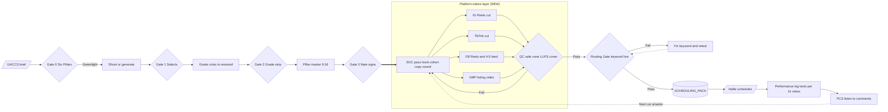
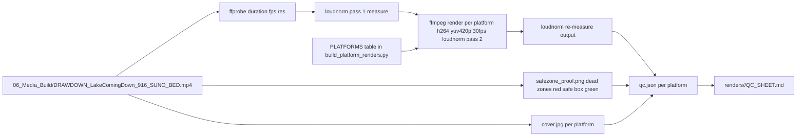

# Platform-native render pipeline — architecture (2026-09-07)

**Linear:** Lake Austin Drawdown Campaign — media blitz + revenue capture (Oct 2026)
**Research:** `docs/research/platform-native-renders-2026-09-07.md` · **Map:** `docs/maps/platform-native-renders.html`
**FigJam:** https://www.figma.com/board/kguEVAEMPpCFkfknnwkueB
**Status:** Slice 1 tracer built and run 2026-09-07. Slices 2–3 tracked in Linear.

## Announcement test

Every Lake Austin drawdown video ATX posts is now cut for the feed it lands in. The Instagram
version keeps its text out from under the like bar. The TikTok version keeps the CTA clear of the
caption block and the right-hand icon rail. The Google listing video is the clean 30-second cut with
no social clutter. Same story, same song, same "Text TRUXOR" — laid out so you can actually read it
on the app you're holding. Nothing goes out until a QC sheet says every version passes.

## System context



Everything left of `gate3` is ATX-Media-Mogul law and already built (`pipeline/WORKFLOW-MAP.md`).
Everything inside the blue box is new. `routing` is ATX-1748, currently **not PASS**.

## Data flow (slice 1, as built)



Output tree: `06_Media_Build/renders/<piece>/<platform>/{render.mp4, safezone_proof.png, cover.jpg, qc.json}`
plus `renders/<piece>/QC_SHEET.md`. Gitignored (media). Slice 2 wires these into
`SCHEDULING_PACK/<slot>/<platform>/` so Hallie uploads the right file per app.

## Integration points

| Point | Contract |
|---|---|
| `build_scheduling_pack.py` | Slice 2 changes the `SLOTS` copy step from "copy master" to "copy `renders/<piece>/<platform>/render.mp4`" keyed on the slot's platform string. Until then the pack ships the master. |
| `build_calendar_page.py` | Add per-platform proof PNGs to the tile so Nate sees the safe-zone check on click. Slice 2. |
| Mogul `doctrine/visual-identity.md` | Strap anchor is 65% of frame height = y 1248 on 1920. TikTok bottom dead zone starts at y 1436 (conservative). Straps survive. CTA strap at the final beat must be checked per platform — it is the one most likely to sit low. |
| Mogul `marketing/platform-routing.md` | "Per-platform rules — TBD" gets filled from the `PLATFORMS` table once Nate rules on it. One source: the code. |
| Routing Gate (ATX-1748) | QC PASS does not mean publish. Pack rows stay draft until `keyword-routing-test.md` carries a dated PASS. |
| `voice-qa.sh` (referenced by pack README; not found on disk) | Banned-string scan must run on every per-platform caption. Slice 2 either finds it or replaces it with the grep already used in BOARD verification. |

## Least confident decisions

1. **Safe-zone pixel values.** From 2026 third-party guides, not platform docs. FB Reels and GBP rows are assumptions. Mitigation: proof PNG per render; Nate checks on a phone before Sep 14.
2. **GBP treated as "clean cut, no overlay."** GBP surfaces crop thumbnails to 16:9 / 1:1 in some placements; the listing video itself plays 9:16. If the cover crops badly, GBP gets its own 1:1 cover in slice 2.
3. **−14 LUFS for all four.** Matches Mogul law. TikTok normalizes on upload anyway; GBP does not. Held at −14 until a measured reason appears.
4. **Slice 1 does not re-lay-out straps.** It renders and proves. If the proof shows the CTA strap under the TikTok caption block, slice 2 moves it — the master is not re-cut for one platform.
5. **Sound per platform (SOC #3) deferred to slice 3.** The Suno bed is burned in. Whether TikTok gets an in-app sound instead is a Nate call after the Sep 14 numbers.
6. **Output lives in the kitchen, not Mogul.** Mogul owns doctrine; the campaign repo owns this campaign's renders. Mogul's `platform-routing.md` gets the ruled table back, not the code.

## Vertical slices

**Slice 1 — tracer (built 2026-09-07).** `build_platform_renders.py` takes one master, emits four
platform renders + proof PNGs + covers + `QC_SHEET.md`. Measurable checks only: resolution, fps,
duration ≤ platform max, output LUFS within ±1 of target. Human check: the proof PNG. Runs in ~1 min.

**Slice 2 — real happy path.** Per-platform strap/CTA re-layout using the existing card renderer
(`build_lake_coming_down.py` card pipeline) with a per-platform anchor; per-platform cover frame
picked (first frame for IG/TikTok, 1s for GBP); captions burned via `embedded-captions` for muted
autoplay; `build_scheduling_pack.py` copies `render.mp4` per platform; calendar tile shows the proof.
Ends testable: rebuild pack, every Sep 14 folder holds a platform-specific file with a different md5.

**Slice 3 — SOC + PCS loop.** One SOC checklist file per piece (hook 0–3s, cohort line, platform
caption, sound choice, CTA legibility); `performance-log.md` row per post with texts-per-1k-views;
PCS notes feed the next cut. GACCS brief from `mkt1_gaccs` as the top of the funnel.

**Banned order:** all-the-renders → all-the-captions → all-the-pack-wiring with nothing visible.
Each slice ends with a file Nate can open.

## Do not touch

- `DRAWDOWN_LakeComingDown_916_SUNO_BED.mp4` and every other signed master — read-only inputs.
- `weeks/2026-08-31/BOARD.md` — append only.
- `SCHEDULING_PACK/` layout for slots already handed to Hallie (Sep 7 → Sep 11) — slice 2 changes Sep 14 onward only.
- Mogul gates, CTA wording, phone number, banned-string set.

## Verification

```bash
cd 06_Media_Build && python3 build_platform_renders.py            # slice 1; prints PASS/FAIL per platform
open renders/DRAWDOWN_LakeComingDown_916_SUNO_BED/QC_SHEET.md
grep -rniE '\$695|inspection|unofficial|extinct' renders/*/QC_SHEET.md || echo CLEAN
```
